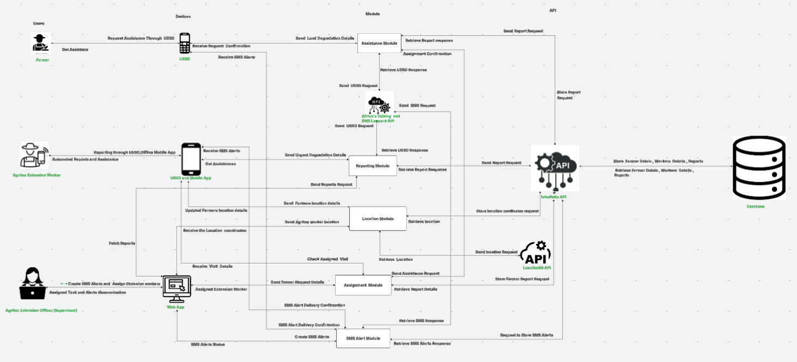
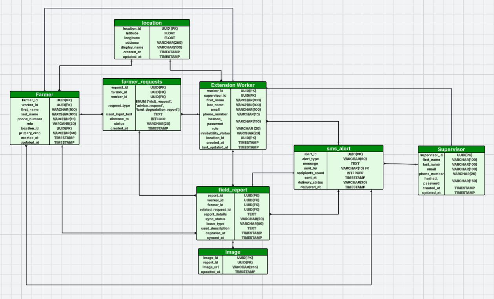

# 2. Architecture

This page explains the architectural principles behind IvhuRedu. It describes the core design ideas, how the system is organized into components, how data moves between those components, the visual design rules, and how the platform can grow to handle more users over time.

---

## Core Principles

The IvhuRedu architecture is built on five core principles that guide every technical decision.

### Centralized API

All communication between the user-facing parts of the platform flows through a single backend API. The USSD service, the mobile application, and the web dashboard never talk directly to each other. Every request goes to the backend first. This ensures data consistency because all three channels read from and write to the same database. It also simplifies security because there is only one entry point to protect.

### Role-Based Access Control

Different users see different features based on their role. Farmers access only USSD menus. Extension Workers access only mobile app features. Supervisors and Administrators access the web dashboard with different permission levels. The backend enforces these rules for every API request so users cannot access functions outside their role.

### Offline-First Mobile Design

Extension Workers often operate in rural areas with poor network coverage. The mobile application is designed to work offline when there is no signal. Workers can view cached data, create reports, and take photos. The app stores this information locally and synchronizes with the backend when connectivity returns. This ensures field work is never blocked by network problems.

### USSD for Universal Access

Farmers use basic mobile phones that may not have internet or smartphone capabilities. USSD works on any phone by dialing a special code. This design choice ensures that every farmer can access the platform regardless of their device or data plan.

### Modular Backend

The backend is divided into modules that each handle one type of task. The Assistance Module handles farmer requests. The Reporting Module handles field reports. The Location Module handles geographic data. The Assignment Module handles task distribution. The SMS Alert Module handles messaging. This modular structure makes the codebase easier to maintain, test, and extend.

---

## System Diagram

The system architecture consists of three user-facing channels, one backend API, one database, and two external services. The following description represents the architecture shown in the system diagram.

At the top are the users. Farmers connect through USSD on basic phones. Extension Workers connect through the Flutter mobile app on smartphones. Supervisors and Administrators connect through the Next.js web dashboard on computers.

In the middle is the IvhuRedu REST API built with FastAPI. This is the central hub. It receives requests from all three channels, processes them using the appropriate module, and returns responses.

Below the API is the PostgreSQL database. It stores all platform data including user accounts, farmer profiles, extension worker details, field reports, images, locations, assignments, requests, and SMS logs.

To the side are two external integrations. Africa's Talking handles USSD sessions and SMS delivery. LocationIQ provides geocoding, reverse geocoding, and address autocomplete services.

The arrows in the architecture show that all user channels point to the backend API. The backend API points to the database. The backend also points to Africa's Talking and LocationIQ when it needs their services. No arrow connects the user channels directly to each other or to the external services.

---

## Component Breakdown

Each major component of the platform serves a specific purpose and uses specific technologies.

### Frontend Web Dashboard

The web dashboard is built with Next.js, a React framework. It runs in the browser and provides a rich interface for supervisors and administrators. It communicates with the backend through REST API calls. It displays data in tables, charts, and forms. It handles user authentication, form validation, and responsive layout.

### Mobile Application

The mobile app is built with Flutter and Dart. It compiles to native Android code. It provides screens for authentication, farmer management, assignment viewing, report creation, and profile management. It uses the device camera for photos and the device GPS for location. It communicates with the backend through REST API calls and stores data locally for offline use.

### USSD Service

The USSD service is not a separate application but rather a set of endpoints and menu definitions within the backend. When Africa's Talking receives a USSD session from a farmer's phone, it sends the input to the backend. The backend processes the input, determines the next menu, and returns the response to Africa's Talking, which displays it on the farmer's phone.

### Backend API

The backend is built with FastAPI, a modern Python web framework. It exposes REST endpoints for all platform operations. It uses Pydantic for data validation, SQLAlchemy or SQLModel for database operations, and JWT tokens for authentication. It is organized into routers, services, and models. It runs on an ASGI server such as Uvicorn.

### Database

PostgreSQL is the relational database that stores all persistent data. It uses UUIDs as primary keys for security and flexibility. It supports spatial data through PostGIS extensions for storing and querying location coordinates. It stores farmer details, worker details, reports, images, locations, requests, assignments, SMS logs, and user accounts.

### Africa's Talking Integration

Africa's Talking is a third-party service that provides USSD and SMS capabilities in African markets. The backend registers a webhook URL with Africa's Talking. When a farmer initiates a USSD session, Africa's Talking sends the session details to this webhook. When the backend needs to send an SMS, it calls the Africa's Talking API.

### LocationIQ Integration

LocationIQ is a third-party mapping service. The backend calls the LocationIQ API when it needs to convert an address to coordinates, convert coordinates to an address, or suggest addresses as a user types. The backend stores the results in the database so future lookups do not require another API call.

---

## Data Flow

Data moves through the platform in a predictable pattern. Understanding this flow helps developers trace how information gets from the user to the database and back.

### Farmer Request Flow

A farmer dials the USSD code. Africa's Talking creates a session and sends the phone number, input, and session ID to the backend USSD endpoint. The backend parses the input, determines which menu to show, and stores any completed request in the database. The response flows back through Africa's Talking to the farmer's phone as text.

### Assignment Flow

A supervisor views pending farmer requests on the dashboard. The dashboard fetches requests from the backend API. The supervisor selects a request and an Extension Worker. The dashboard sends an assignment request to the backend. The backend stores the assignment and updates the request status. The mobile app fetches the worker's assignments from the backend. The worker sees the new assignment.

### Report Submission Flow

An Extension Worker creates a field report in the mobile app. The app sends the report data, images, and location to the backend. The backend stores the report in the database. Images are saved to storage and linked to the report. The backend updates related records such as the farmer profile and assignment status. The dashboard fetches the new report and displays it to supervisors.

### SMS Alert Flow

A supervisor sends an SMS alert from the dashboard. The dashboard sends the message details to the backend SMS endpoint. The backend stores the message in the SMS log and calls the Africa's Talking or SMS Leopard API to deliver the message. The external service sends the SMS to the recipient's phone. The external service may send a delivery callback to the backend, which updates the message status in the log.

---

## Design Guidelines

The visual design of IvhuRedu follows strict brand guidelines to create a consistent experience across all channels.

### Color Palette

The primary colors carry meaning related to agriculture and land.

| Color | Meaning | Usage |
|---|---|---|
| Soil Brown | Represents the soil and land restoration | Navigation bars, dark cards, container backgrounds, main navigation |
| Vegetation Green | Represents healthy crop growth and recovery | Primary action buttons, success states, agricultural advisory highlights |
| Deep Charcoal | High-contrast dark elements | Body text, structural dividers |
| Sun Gold / Amber | Warnings and important highlights | Secondary actions, highlight buttons, land degradation warnings, pending status |

### Typography

The Inter font family is used across all interfaces. The weights used are Regular at 400, Medium at 500, Semi-Bold at 600, and Bold at 700. This typeface is applied consistently to headings, body copy, labels, and buttons on both web and mobile.

### Logo Usage

The primary logo features the capital letter I styled as a vertical soil bed with a green plant shoot at the top, alongside the IvhuRedu wordmark in deep soil brown and vegetation green. The brown base of the I represents cultivated soil, while the green leaf shoot represents healthy crop growth restored through extension support. The logo must always have adequate padding around it. It must never be stretched, recolored, or modified.

### Responsive Design

The web dashboard is responsive and works on different screen sizes. However, it is primarily designed for desktop and laptop use. The mobile application is designed for Android smartphones. The USSD interface works on any mobile phone with a basic screen.

---

## Scalability Strategy

The platform is designed to grow as more farmers, workers, and supervisors join.

### Backend Scaling

The backend is deployed on Heroku. Heroku dynos can scale automatically based on traffic. If many users access the platform at the same time, Heroku can add more server instances to handle the load. The backend is stateless, meaning any instance can handle any request. This makes horizontal scaling straightforward.

### Database Scaling

PostgreSQL performance is maintained by using indexes on frequently queried columns. Primary keys use UUIDs. Spatial queries use PostGIS spatial indexes. As the database grows, query performance is preserved. If needed, the database can be upgraded to a larger plan on Heroku or migrated to a dedicated database server.

### Caching

Frequently accessed data such as farmer lists, worker availability, and dashboard analytics can be cached to reduce database load. The backend can implement caching at the API layer or use a caching service.

### Modular Growth

New features can be added as new backend modules without disrupting existing ones. For example, a new module for weather data or market prices could be added alongside the existing modules. The API can expose new endpoints while keeping old ones stable.

### Mobile App Distribution

The Flutter mobile app can be distributed through Google Play or internal distribution channels. As the user base grows, updates can be pushed to all devices. The app is designed to handle larger datasets through pagination and local caching.