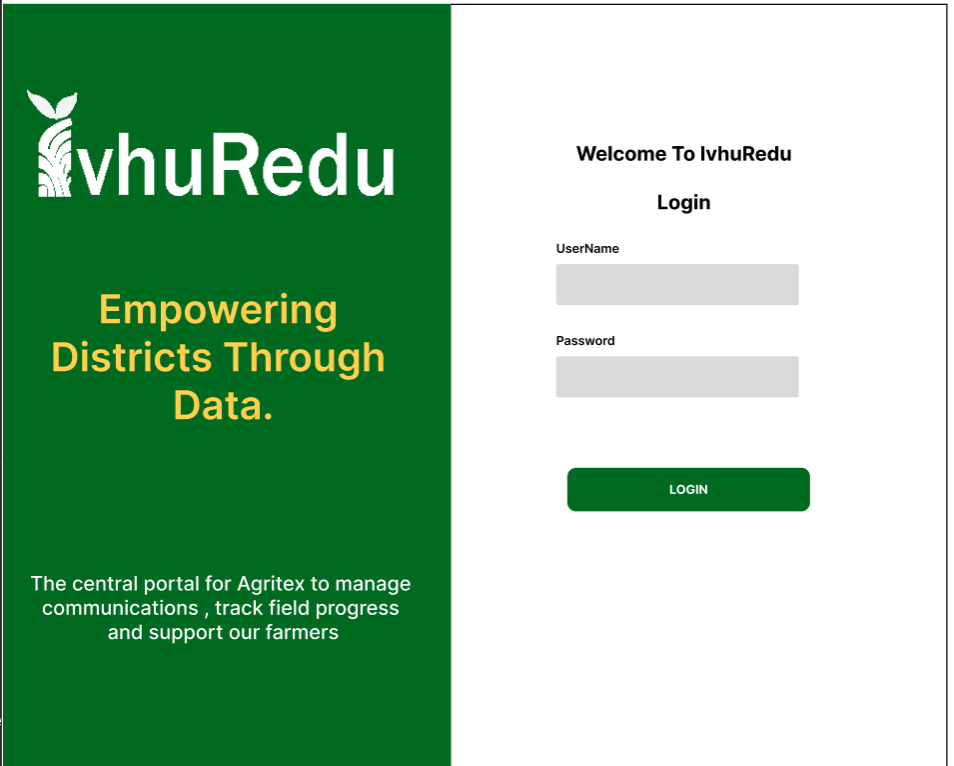

# 4. Frontend Web

This page describes the IvhuRedu web dashboard. It covers what the dashboard is, the technologies used, what you need to start developing, how to install it, how the project is organized, the coding rules, how users log in, how it connects to the backend, the pages and features it provides, how it is styled, how errors are handled, how it is tested, and how it is deployed.

---

## Overview

The IvhuRedu web dashboard is a Next.js application used by Administrators and Supervisors. It provides a centralized interface for managing users, monitoring agricultural information, handling farmer requests, sending SMS alerts, and configuring settings.

Extension Field Workers do not use the web dashboard. They use the Flutter mobile application for all their field work. The dashboard is designed for desktop and laptop computers with larger screens.

The dashboard communicates with the backend API for all data operations. It does not store data locally beyond session tokens and cached page data. All persistent information lives in the PostgreSQL database accessed through the backend.

---

## Technology Stack

The web dashboard is built with the following technologies.

| Piece | Technology | Purpose |
|---|---|---|
| Framework | Next.js | A React framework for building fast, server-rendered web applications. It handles routing, page rendering, and API routes. |
| Language | JavaScript / TypeScript | The programming language used to write the application logic and components. |
| Linting | ESLint + Prettier | ESLint checks for code quality issues and potential bugs. Prettier formats the code to follow consistent style rules. |
| Documentation | JSDoc | A standard for writing documentation comments in JavaScript code. It describes what functions and components do. |

---

## Prerequisites

Before you can set up the web dashboard for development, you need the following.

| Requirement | Purpose |
|---|---|
| Node.js | For running the Next.js application |
| npm | For installing packages, comes with Node.js |
| Backend API access | Local or hosted backend for data operations |
| `.env` file | Contains frontend configuration values such as the backend API URL |

---

## Setup and Installation

Follow these steps to set up the web dashboard on your local machine.

1. Clone the repository from GitHub and navigate to the web directory.

2. Install the project dependencies using npm.

3. Create a local environment file by copying the example file.

4. Open the `.env.local` file and fill in the required values such as the backend API URL.

5. Start the development server.

The dashboard will be available at `http://localhost:3000`. Changes you make to the code will automatically refresh the browser.

Useful commands during development include running tests with `npm test` and checking code formatting with `npm run format`.

---

## Project Structure

The web dashboard code lives in the `web/` directory at the root of the repository. This directory contains the full Next.js application.

The project structure follows Next.js conventions.

| Directory | Contents |
|---|---|
| `pages/` | Main pages of the dashboard |
| `components/` | Reusable user interface pieces such as buttons, tables, and forms |
| `styles/` | CSS and styling rules |
| `public/` | Static assets such as images and fonts |
| `lib/` or `utils/` | Helper functions for API calls, authentication, and data formatting |

---

## Coding Standards

The web dashboard follows strict coding standards to keep the codebase clean and maintainable.

### Linting

Prettier and ESLint are used together. Prettier formats the code automatically. ESLint checks for problematic patterns. Both tools should be run before committing code.

### Component Design

Keep components small, focused, and reusable. Each component should do one thing well. If a component grows too large, split it into smaller sub-components. Reuse components across different pages instead of duplicating code.

### Documentation

Use JSDoc comments for all functions and components. Explain what the component does, what props it accepts, and what it returns. Update the README and feature documentation whenever you make a change that affects how the dashboard works.

---

## Authentication Flow

The dashboard uses token-based authentication. Here is how the login process works.

1. An administrator or supervisor visits the dashboard login page and enters their registered credentials.

2. The dashboard sends the credentials to the backend login endpoint.

3. If the credentials are valid, the backend returns an access token, a refresh token, the user's role, and a flag indicating whether they must change their password.

4. The dashboard stores the access token securely and uses it in the authorization header of every subsequent API request.

5. If the access token expires, the dashboard can use the refresh token to obtain a new access token without asking the user to log in again.

6. If the session expires completely or the refresh token is invalid, the user is redirected to the login page.

7. Users can change their password at any time from the Settings page under Change Password.

---

## API Integration

The dashboard communicates with the backend through REST API calls. It does not talk directly to the database or external services. Every data operation goes through the backend.

The dashboard uses the access token to authenticate its requests. It sends the token in the Authorization header of each HTTP request. If the token is missing or invalid, the backend returns a 401 error and the dashboard redirects the user to the login page.

The dashboard fetches and updates the following types of data through the API.

| Data Type | Operations |
|---|---|
| User management | Creating, reading, updating, and deleting system users |
| Extension Worker management | Registering workers and updating their status |
| Farmer request management | Viewing, filtering, assigning, and tracking requests |
| Field report retrieval | Fetching reports submitted by workers |
| Analytics data retrieval | Getting statistics and metrics for the dashboard charts |
| SMS management | Sending messages and viewing history |
| Profile and password management | Updating personal information |

---

## Pages and Features

The dashboard has five main navigation sections.

### User Management

Administrators can register new supervisors and view all registered users. Supervisors can register new Extension Field Workers, enter their information, assign them to wards, view their availability and status, and manage worker records.

### Analytics

The analytics section provides statistics about agricultural and field operations. It displays the following metrics.

| Metric | Description |
|---|---|
| Total registered farmers | Number of farmers in the system |
| Field visits completed | Number of visits carried out by workers |
| Disease and pest reports | Reports about crop health issues |
| Crop distribution | Types of crops across different wards |
| Ward-level analysis | Statistics broken down by ward |
| Harvest and yield information | Production data from farms |
| Sustainability metrics | Land restoration and soil health data |
| Worker engagement | Activity levels of Extension Workers |
| GPS visit tracking | Location data from field visits |

### Farmer Request

This section allows supervisors to manage assistance requests submitted by farmers through USSD. Supervisors can view incoming requests, search for specific requests, filter requests by status, view farmer and location information, assign requests to Extension Field Workers, track the progress of each request, and monitor resolution.

Request statuses include the following.

| Status | Meaning |
|---|---|
| Pending | New request, not yet assigned |
| In Progress | Assigned to a worker, being handled |
| Resolved | Worker submitted a report, issue addressed |

### SMS Alerts

This section allows authorized dashboard users to manage SMS communication. Users can send individual SMS messages, send broadcast messages to multiple recipients, send ward-based alerts to all farmers in a specific ward, monitor the delivery status of sent messages, and view the history of SMS communication.

SMS communication is handled through the configured SMS provider, which connects to Africa's Talking or SMS Leopard.

### Settings

The settings section has multiple tabs.

| Tab | Contents |
|---|---|
| General | User role, default date range, refresh interval |
| Profile | First name, last name, email, phone number, role |
| Change Password | Current password, new password, confirmation |
| Display | Real-time data toggle, chart labels, compact view |
| Notifications | Preferences for alerts, broadcasts, system notifications |
| Account | Logout button |

---

## Styling

The dashboard follows the IvhuRedu Brand Guidelines for all visual elements.

| Element | Color | Usage |
|---|---|---|
| Navigation bars | Soil Brown | Main navigation and headers |
| Primary buttons | Vegetation Green | Main actions and success states |
| Warnings and pending | Sun Gold / Amber | Alerts and secondary actions |
| Text | Deep Charcoal | Body text and labels |

The Inter font family is used for all text. Buttons have defined styles for primary, secondary, and utility actions. Icons use the custom agricultural icon set with variants for different states.

---

## Error Handling

The dashboard provides clear feedback when operations succeed or fail.

| Error Type | Behavior |
|---|---|
| Form validation | Checks required fields before submission, shows messages for invalid data |
| Authentication errors | Redirects to login page when session expires |
| Authorization errors | Blocks access to functions outside the user's role |
| API errors | Displays a clear message when a backend request fails |
| Success feedback | Shows confirmation after a successful action |

---

## QA Documentation

The web dashboard is tested to verify that all functionality works correctly.

Testing covers the following areas.

| Test Area | What Is Checked |
|---|---|
| Component rendering | UI components display correctly |
| Form validation | Required fields and input formats |
| Authentication flows | Login, logout, session expiry, token refresh |
| Role and permission enforcement | Users can only access allowed features |
| API integration | Data flows correctly between dashboard and backend |
| User management | Creating and editing users |
| Farmer request handling | Viewing, assigning, and tracking requests |
| SMS alert functionality | Sending and monitoring messages |
| Settings changes | Profile updates and preferences |
| Responsive layout | Display on different screen sizes |
| Usability | Real user testing with supervisors |

Tests can be run using `npm test`. Formatting can be checked using `npm run format`.

---

## Deployment

The web dashboard is built with Next.js. The informational website is deployed to Vercel. The exact deployment target and pipeline for the dashboard should be documented once confirmed. The deployment process follows the same branch-based workflow as the backend. Code is reviewed through pull requests, merged into the main branch, and then deployed to the hosting platform.